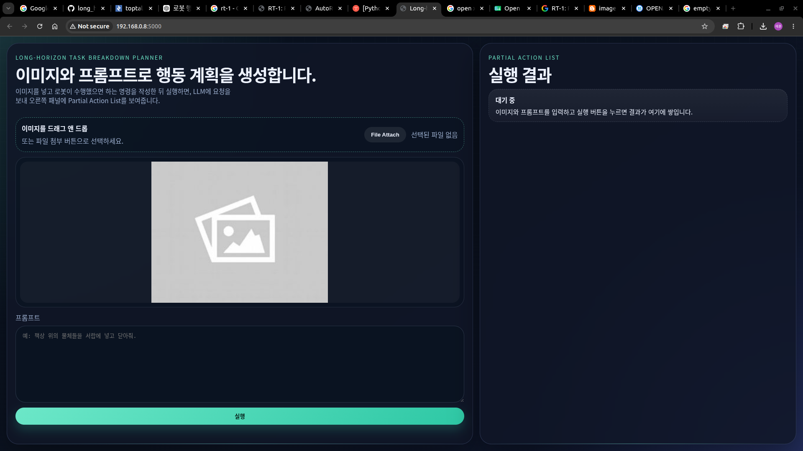
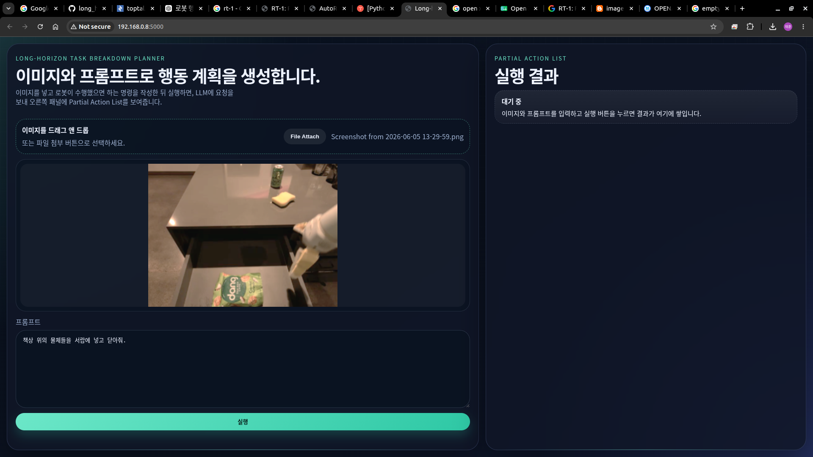
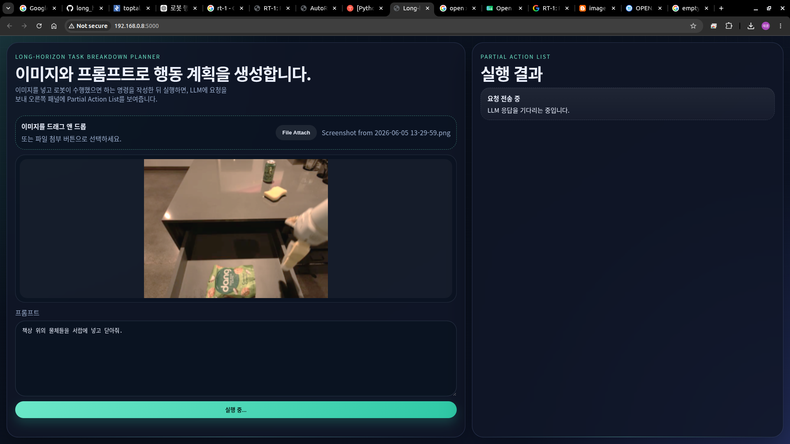
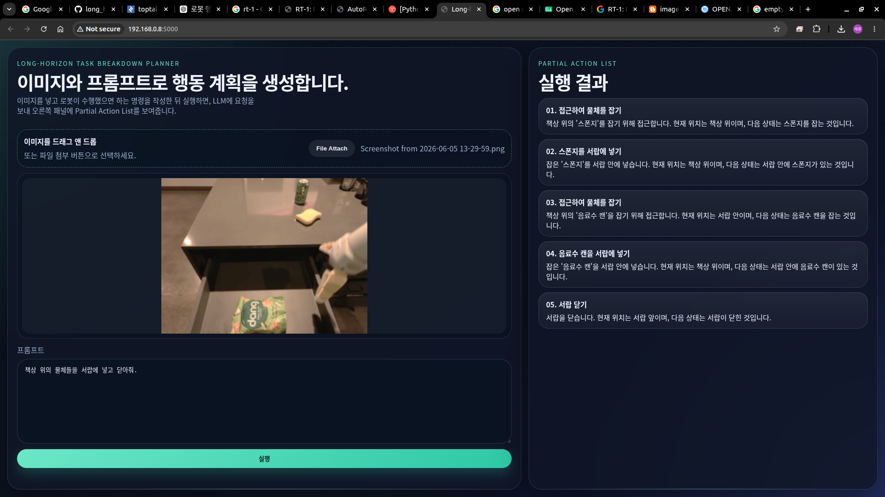

# 260605 중간 결과 보고

- 아래 이미지는 현재까지 구현된 기능들을 실행한 결과를 순차적으로 보여줍니다.

## 1. User Interface

- (이미지 첨부) 이미지를 드래그 앤 드롭 또는 파일 선택하여 첨부할 수 있음
- (프롬프팅) 로봇이 수행한 작업을 지시하기 위한 창
- (실행 결과창) Breakdown된 action을 보여주기 위한 창

## 2. Attaching Image & Prompting

## 3. 260605_4

> ChatGPT API -> Ollama 활용한 multimodal model server로 변경 예정

## 5. 260605_5

> 현재 LLM 응답 출력까지만 구현됨. 이후 Vector DB를 활용하여 실제 구동 가능한 유사도 높은 action 출력만 가능하도록 변경 예정 \
> 또한 적합한 출력을 위하여 System prompt 보완 예정

